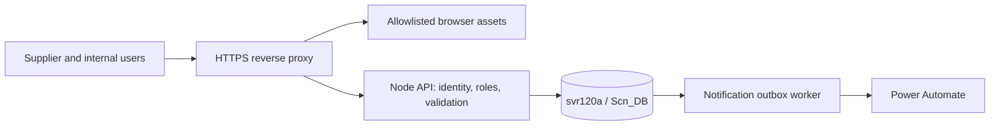

# Firebase to SQL Server migration plan

Status: SQL-backed runtime and initial database setup implemented and verified. This document retains the broader target checklist; unchecked future criteria remain pending. See the API inventory for implemented behavior.
Updated: 2026-10-05. Target: `svr120a / Scn_DB`, SQL Server 2014 compatibility 120. Migration 001, 21 application tables plus migration history, master-data version 1 and `itadmin` bootstrap are created. Authentication uses application accounts stored in SQL tables. All seven email groups are empty. Real SQL smoke writes were rolled back; existing Firebase records have not been imported.

Supporting specifications:
- [API inventory and target contract](sql-server-api-checklist.md)
- [Source-to-table and field mapping](sql-server-table-mapping.md)

## 1. Scope and target architecture

Move application persistence from Firestore and the local JSON file to SQL Server. Replace Firebase Authentication, Hosting, and the workflow Cloud Function so production has no Firebase runtime dependency. Keep the existing Node backend and browser forms as the starting point; rewriting the application in .NET is not necessary for SQL Server.

SQL Server will hold PCNs, child records, internal review data, audit history, routing, users/password hashes/roles/sessions, counters, notification jobs, and migration history. Baseline attachment design also stores file bytes in SQL Server; confirm file volume and DBA backup limits before implementation. Power Automate remains an external email/directory integration. The Node API verifies application passwords and permissions against SQL user tables; each end user has an application account, separate from the backend SQL connection login.

Supplier access requires an externally reachable HTTPS portal or an approved access mechanism. Place the API where it can reach `svr120a` privately. Expose HTTPS through the approved reverse proxy; keep SQL ports private.

## 2. Prototype inventory before migration

| Area | Observed implementation | Migration consequence |
|---|---|---|
| Hosted persistence | `firebase-client.js` routes API-like requests directly into Firestore | Replace browser adapter and remove Firebase-first selection in both browser scripts |
| Local persistence | `src/pcnRepository.js` reads/writes `data/pcn-db.json` | Introduce SQL aggregate repository; remove production JSON writes |
| Service coupling | `src/pcnService.js` calls `readDb`, `updateDb`, and `makeAuditLog` for settings and ID generation | A SQL CRUD adapter alone is insufficient; refactor the repository contract and transaction boundaries |
| Firestore collections | `pcn_requests`, `audit_logs`, `counters`, `notification_settings` | Export all four, including `notification_settings/workflow` and `counters/pcn_years` |
| Hosted authentication | Anonymous Firebase sign-in; Firestore rules permit all signed-in users to access all PCNs/settings | Add named identities, roles, and supplier ownership checks |
| Hosted admin | `admin.js` uses a browser password hash and local/session storage; chooses this mode for non-localhost hosts | Replace hostname-based authentication selection and client-only admin enforcement |
| Local authorization | Only settings and deletion require admin; other PCN routes are broadly open | Protect every API operation and every editable field on the server |
| Workflow | Status checks exist on the server; checkbox order and group dependencies live primarily in `app.js` | Validate signoff order and role permissions on the server as well |
| Email | Browser public webhook fallback, optional Firebase Function, and local Node mailer | Use server-only secrets and a durable notification outbox |
| Directory search | `admin.js` calls the configured Power Automate URL directly | Add a protected server endpoint; remove browser webhook calls |
| Attachments | Document metadata flags; Storage rules deny every read/write; no implemented upload API was found | Preserve metadata; actual upload/download is an explicit implementation workstream |
| Master data | Both `master-data.js` and `src/masterData.js`; browser prefers bundled values | Seed versioned SQL master data; make the API authoritative |
| Static serving | Node serves paths from the repository root | Serve an explicit asset allowlist; block data/config/source/test/plan files |
| Health | `/api/health` does not check persistence | Separate liveness from database readiness |

Local inspection found **3 PCNs and 54 audit entries** in the JSON file. These are local counts, not a production Firestore inventory. Firestore documents can contain additional fields because hosted writes are less restrictive than the local service. Preserve raw exports and reconcile every field before imposing the local schema.

This workspace has no Git repository. Execution can proceed with backed-up local edits; initialize version control or connect the intended repository before relying on branch/PR deployment controls. Ruflo/ToolSearch tools were not exposed in this planning session.

## 3. Decisions and prerequisites

| Decision | Recommendation / known value | Owner / evidence needed |
|---|---|---|
| Server | `svr120a` supplied by user | DBA: instance, DNS/FQDN, TCP port, SQL version, reachability from deployment host |
| Database | `Scn_DB` exists; tables pending, confirmed by user | DBA: dedicated application schema, existing objects/collation and runtime permissions |
| SQL account | `scndb` supplied; privileges unknown | DBA: dedicated least-privilege runtime identity and separate migration identity |
| Secrets | Secret manager or protected deployment environment | IT: rotate the password shared in conversation; never put it in files, browser code, logs, or examples |
| Identity | Custom SQL-backed user authentication, confirmed by user | Application/IT: username/email policy, account invitations, password/reset/session policy, reviewed supplier membership |
| Hosting | HTTPS reverse proxy + Node service near SQL | IT: host, approved runtime version, DNS, certificate, supplier network access, service restart policy |
| File storage | SQL metadata and `varbinary(max)` content for bounded attachments | DBA: per-file limit, total volume, streaming, backup impact; alternative approved storage requires a documented design change |
| Email/directory | Retain Power Automate, call from API/worker only | Integration owner: allowed hosts, rotated webhook secrets, test recipients, response contract |
| Source of truth | Determine authoritative Firestore project and any independently edited JSON records | Product owner: export access, record counts, source precedence and collision resolution |
| Workflow semantics | Preserve RL0 bypass and RL1/RL2/RL3 TaPBU gate | QA/GSC: signoff order, final judgment, supplier edit windows, closure and retention rules |
| Operations | Define RPO, RTO, retention and availability target | IT/DBA: backup/restore rehearsal, monitoring, deployment and cutover window |

The supplied string is an SSMS profile, not a ready Node configuration: it omits the database, disables pooling, uses an infinite command timeout, and names SSMS as the application. Set the application database explicitly to `Scn_DB`. Proposed backend settings are separate secret-backed server/database/user/password values, encryption enabled, a bounded reusable pool, finite connection/query timeouts, and application name `supplier-pcn-workflow`. Use a validated server certificate in production; `TrustServerCertificate=True` bypasses certificate validation. Verify the server FQDN against the certificate before changing it. [Microsoft connection security](https://learn.microsoft.com/en-us/sql/connect/ado-net/sql/application-security-scenarios-sql-server?view=sql-server-ver17)

Use the maintained `mssql` package with its default Tedious driver unless deployment requirements dictate Windows integrated authentication. Configure typed parameters, pooled connections and explicit transactions according to the [driver documentation](https://github.com/tediousjs/node-mssql). Select and pin a supported package/runtime version at implementation time; none has been installed by this plan.

## 4. Ordered implementation checklist

Each step is a reviewable change set. All boxes represent future work. Roles below are responsibilities, not assignments already accepted by a named person. Add tests that demonstrate the required behavior before implementation, then run unit, integration and browser checks; aim for at least 80% coverage of changed application modules.

### Step 1 — Confirm infrastructure and baseline

Context: `Scn_DB` exists and custom SQL-backed authentication is selected; table layout and production source still need verification. Current application is a prototype with two persistence paths. Owner: IT/DBA + application lead. Dependencies: none.

- [ ] Resolve the decisions in section 3; capture server version, database compatibility, schema, permissions, port, TLS, identity, storage, hosting and backup requirements.
- [ ] Obtain approved Firestore exports and a secured copy of the local JSON; inventory source keys, IDs, counters, timestamps, audit actors and settings without exposing secrets.
- [ ] Confirm whether Firebase Storage contains any historical objects despite the current deny-all rules.
- [ ] Run the existing `npm test`; inventory untested workflow and browser behavior. Record the original deployment, assets, DNS and recoverable backups.
- [ ] Establish a staging database and staging host; prohibit test emails to production recipients.

Verification: metadata-only DBA inspection, staging connection test, baseline `npm test`, backup evidence. Exit: target and source inventory agreed, staging reachable, credentials safely supplied. Rollback: no production changes in this step.

### Step 2 — Create versioned SQL schema and connection layer

Context: use the companion mapping as the proposed schema; it is not an inspected schema of `svr120a`. Owner: backend + DBA. Dependencies: step 1.

- [ ] Write additive versioned migrations for the mapped tables, keys, FKs, checks and indexes; record applied versions in `SchemaMigrations`.
- [ ] Seed master data from the current workbook-derived definitions and notification groups; record version/checksum.
- [ ] Add secret-backed SQL configuration, startup validation, connection pool, graceful shutdown, typed queries and transaction helper.
- [ ] Split liveness/readiness and fail production startup for missing configuration; never silently switch to JSON or Firestore.
- [ ] Grant runtime only required data/procedure permissions; retain DDL permissions in a separate deployment identity.

Verification: apply migrations to an empty staging DB and apply again safely; unit configuration checks; real SQL connectivity/TLS, rollback and permission tests. Exit: schema reproducible and bounded DB failure behavior demonstrated. Rollback: restore staging backup or reverse only unused additive schema changes.

### Step 3 — Refactor repositories and implement transaction-safe APIs

Context: `PcnService` currently depends on whole-database JSON methods; `httpServer` already supports repository/service injection. Owner: backend. Dependencies: step 2.

- [ ] Define aggregate methods for list/get, transactional create/update/delete, append comment/approval, settings, audit and notification enqueue. Remove `readDb`/`updateDb` service dependencies.
- [ ] Hydrate the existing PCN JSON shape from SQL child tables, including array order, omitted fields, date strings and internal-review JSON.
- [ ] Allocate yearly PCN codes inside the same SQL transaction as insert and audit; enforce uniqueness and seed from exported counters and all historical IDs.
- [ ] Add `rowversion` concurrency tokens and conditional updates; return 409 for stale writes and handle bounded deadlock retries.
- [ ] Make record/child/audit/outbox changes atomic. Never send email inside the database transaction.
- [ ] Preserve current endpoint envelopes and direct links; add pagination with compatible `data` array plus metadata, updating both clients to iterate pages.
- [ ] Decide soft deletion/retention and add audit reads; retain historic deleted-entity audits.

Verification: existing `npm test` plus real-SQL create/update round trips, injected rollback, concurrent allocation, child append and stale-update checks using test identities. Exit: persistence API contracts and aggregate hydration are verified; authentication, attachment and integration rows are completed in steps 4–5 before any production access. Rollback: keep SQL changes in staging; old deployment stays the production writer until cutover.

### Step 4 — Enforce identity, ownership and workflow permissions

Context: anonymous Firebase and browser-only admin checks do not establish employee/supplier identity. Owner: backend + identity team + QA. Dependencies: steps 1 and 3.

- [ ] Implement SQL user accounts, salted Argon2id password verification, server sessions and account-to-supplier mapping; discard old browser and Firebase sessions at cutover.
- [ ] Add username/email login, logout, current session, authenticated password change, invitation activation and forgotten-password/reset endpoints. Disable open self-registration initially; admin approves accounts and supplier membership.
- [ ] Store only password hashes and session/reset/invitation token hashes. Revoke sessions on password reset, account disabling and role changes; invalidate outstanding recovery/activation links on password/email changes or disabling, and validate token purpose/account state/security stamp at consumption. Use generic login/reset responses and bounded distributed throttling/temporary lockout.
- [ ] Bootstrap the first administrator through a controlled one-time activation process; do not seed a common/default password. Decide administrator MFA before production access.
- [ ] Add role and record scope checks to list, get, write, comments, approvals, files, settings, audit and notification APIs.
- [ ] Derive actor and approval role from verified identity; prohibit client-supplied roles from granting privileges.
- [ ] Separate supplier fields from internal review fields; validate checkbox order, prerequisite gates, final judgment and RL-dependent TaPBU rules on the server.
- [ ] Preserve historical anonymous actors as legacy provenance; require reviewed ownership mappings before granting supplier visibility.
- [ ] Secure sessions with appropriate HttpOnly/Secure/SameSite cookies, CSRF controls, expiry/revocation and rate limits; remove default/shared production passwords.
- [ ] Restrict static files to approved public assets; verify `/data/pcn-db.json`, `/src/*`, `/test/*`, `/plans/*` and config/secret files are inaccessible.

Verification: authorization matrix tests, direct HTTP bypass attempts, supplier isolation, valid/invalid step transitions, expiry and CSRF tests. Exit: identity and workflow gates hold without browser checks. Rollback: disable staging rollout; do not reopen broad access as a fix.

Use a maintained password-hashing implementation and benchmark its cost on the deployment host. Baseline Argon2id parameters must meet current OWASP guidance, and hashes must retain algorithm/salt/cost for later upgrades. [OWASP password storage](https://cheatsheetseries.owasp.org/cheatsheets/Password_Storage_Cheat_Sheet.html) Server sessions are revocable records with random opaque cookies; reset/activation tokens are random, expiring and single-use. [OWASP sessions](https://cheatsheetseries.owasp.org/cheatsheets/Session_Management_Cheat_Sheet.html), [OWASP password reset](https://cheatsheetseries.owasp.org/cheatsheets/Forgot_Password_Cheat_Sheet.html)

### Step 5 — Migrate integrations and attachments

Context: current Power Automate has browser fallback and no durable queue; uploads are currently placeholders. Owner: backend + integration team. Dependencies: steps 3 and 4; file design from step 1.

- [ ] Implement SQL notification outbox with per-event deduplication, delivery attempts, lease/claim handling, backoff, retry ceiling and operator-visible failures.
- [ ] Use backend-only mail and directory secrets; return configuration flags to the browser, never signed URLs. Resolve authorized recipients and canonical portal links on the server.
- [ ] Add bounded directory lookup and test-mail APIs; allowlist outbound hosts, validate URLs and redirects, limit returned directory data.
- [ ] Define Power Automate idempotency/delivery acknowledgment. A trigger accepting HTTP is not proof an email arrived; reconcile ambiguous sends and avoid automatic duplicate delivery.
- [ ] Implement bounded multipart file streaming into SQL, malware scanning/quarantine, hash/size/type validation and authorized download. Keep metadata flags separate from verified file existence.
- [ ] Migrate existing real files if discovered; report unavailable historical attachments rather than treating `uploaded=true` as evidence of bytes.

Verification: fake integration tests plus staging flow acceptance/delivery test; queue restart/duplicate/timeout tests; authorized upload/download and SQL backup-size assessment. Exit: integration secrets absent from responses and browser traffic; attachment lifecycle and failed-job recovery agreed. Rollback: pause worker and restore staging attachment data; never replay migration history as email events.

### Step 6 — Replace browser adapters and hosting

Context: `app.js` and `admin.js` both prefer Firebase; hosted admin mode is selected by hostname. Owner: frontend + operations. Dependencies: steps 3–5.

- [ ] Change both `apiFetch` implementations to the HTTP API and real identity sessions for every hostname.
- [ ] Remove Firebase script tags from `form.html` and `admin.html`, Firebase SDK initialization, hosted password/session code and all browser webhook calls.
- [ ] Load authoritative SQL-backed master data instead of preferring bundled master definitions. New PCNs use the active version; existing PCNs load their pinned master version through the version endpoint. Preserve existing labels and review controls.
- [ ] Send concurrency tokens with edits; display conflicts, retryable failures, queue status and expired sessions accurately.
- [ ] Preserve `/`, `/admin`, `/create`, `/PCN-YYYY-NNNN`, supported `/PNC-...` aliases and browser refresh behavior in the reverse proxy.
- [ ] Deploy HTTPS staging with process supervision, request correlation, pool/queue metrics, alerting and asset allowlisting.

Verification: browser E2E on a **non-localhost** staging hostname; SQL-only network requests; staff/supplier access; create/edit/review/notify/file flows and deep links. Exit: no runtime request to Firebase or signed Power Automate URLs. Rollback: restore prior staging frontend/proxy build.

### Step 7 — Build and rehearse the data importer

Context: production Firestore data may differ from the local service schema. Owner: data migration lead + QA/DBA. Dependencies: steps 2–5; can develop alongside step 6 after schema stabilizes.

- [ ] Export all four collections and discovered storage files to a restricted location outside the web root, preserving document IDs, original types, timestamps and checksums.
- [ ] Stage raw records/settings/audits/counters with source identity, source key and import batch; mask secrets in operational reports.
- [ ] Import in dependency order; resolve duplicate PCN codes, unknown fields, missing parents, invalid dates, nested review variants, child IDs and settings conflicts explicitly.
- [ ] Make import resumable and idempotent using source keys/hashes; rehearse repeated runs and interrupted batches.
- [ ] Seed counters from the greatest exported counter, active code and retained historical/deleted code per year; detect the current four-digit ID limit before overflow.
- [ ] Compare counts, ordered child arrays, canonical per-record payloads, audit provenance, routing, master versions and attachment checksums. Record every intentional transformation or exception.
- [ ] Suppress notifications and new application audits during import; migrate historic audits without inventing actors, times or approvals.

Verification: importer dry run, staging import twice, semantic source/SQL comparison, sample RL0–RL3 UI review and attachment hashes. Exit: zero unexplained lost/duplicated records; exceptions resolved and rollback rehearsal completed. Rollback: restore pre-import staging backup; retain immutable source exports.

### Step 8 — Cut over with one writer

Context: concurrent Firestore and SQL writes would produce conflicting histories. Owner: operations + DBA + business approvers. Dependencies: steps 6 and 7 and all test/security gates.

- [ ] Agree outage window, named cutover decision-maker, rollback decision-maker and measurable failure thresholds; obtain deployment approval when the release is concrete.
- [ ] Back up SQL and Firebase, freeze old browser writes and Cloud Function sends, disable scheduled/in-flight producers, and confirm the old system is read-only.
- [ ] Take a final post-freeze export and import/reconcile the delta, including deletions/tombstones or full-manifest differences; finalize counters and ownership mappings.
- [ ] Switch approved DNS/proxy/config to SQL deployment; expire old sessions and invalidate obsolete cached assets. Start SQL as the sole application writer.
- [ ] Run staff/supplier smoke tests, stale-write tests, route tests, attachment checks, routing checks and a controlled email. Enable the outbox worker only after reconciliation.
- [ ] Monitor DB readiness, pool utilization, error rate, latency, deadlocks, failed notification jobs and supplier access through the agreed observation window.

Verification: source/target reconciliation signed by QA/DBA, production smoke checks and monitored acceptance targets. Exit: SQL sole writer, approved access and no Firebase/browser webhook calls.

Rollback: before new SQL writes, restore prior deployment and deliberately re-enable its writer after stopping SQL producers. After new SQL writes, stop all writers/workers, preserve SQL delta and delivery history, and reconcile/export new records back to the recoverable system before any switch. If reverse replay cannot preserve permissions/data, use forward recovery or extend maintenance. A DNS-only rollback would lose new work and is prohibited.

### Step 9 — Retire Firebase and hand over

Context: keep recovery assets until the acceptance window ends. Owner: operations + application lead. Dependencies: step 8 and accepted observation window.

- [ ] Revoke obsolete Firebase access and shut down old Functions/Hosting/resources after approved retention; remove old deployment scripts, SDK files and Firebase config from the active release.
- [ ] Remove production JSON persistence selection and old client passwords/webhook settings; retain only clearly isolated test fixtures if needed.
- [ ] Update README, admin explanatory copy and `agenda.md` architecture references to the implemented design. Archive exports securely outside the application asset root.
- [ ] Document backup/restore, credential renewal, account provisioning, workflow/master version changes, failed-job recovery, attachment retention and deployment rollback.
- [ ] Rehearse restoring the complete SQL database (including attachments, identities and jobs) to an isolated host with email disabled.

Verification: deployment artifact/runtime dependency scan, restore rehearsal, final acceptance record. Exit: no active Firebase dependency, operational ownership accepted. Rollback: restore approved application/SQL backups; historic Firebase restoration requires a deliberate reconciliation plan.

Dependency order: `1 -> 2 -> 3 -> 4 -> 5 -> 6 -> 8 -> 9`; `7` follows schema/integration stabilization in `2–5` and joins `6` before `8`. Steps 6 and 7 can progress independently with shared contract review. Review each change set and address high-severity findings before proceeding; do not commit/push/deploy automatically from this plan.

## 5. Release acceptance checklist

- [ ] Every API in the companion checklist has a test and an assigned implementation owner.
- [ ] SQL round trips retain all mapped fields and historical provenance; no unexplained reconciliation differences remain.
- [ ] Concurrent PCN creation never duplicates codes; stale writes cannot overwrite accepted changes.
- [ ] RL0 bypass, RL1–RL3 TaPBU checks, prepared/checked/approved order, rejected/approved judgments and supplier-action loops work through direct HTTP and the UI.
- [ ] Unauthorized identity, supplier cross-record access, internal-field edits and admin operations are rejected server-side.
- [ ] Queue retries are bounded and visible; verified delivery semantics and replay/deduplication are documented.
- [ ] Actual files are retrievable only by authorized users; upload flags cannot falsely establish file completeness.
- [ ] SQL failure produces an explicit unavailable response and failing readiness; no hidden JSON/Firebase fallback exists.
- [ ] No credentials, signed webhooks, raw migration data, source files or local DB can be retrieved as static content.
- [ ] HTTPS supplier access, approved runtime support, backup/restore, alerts, RPO/RTO and performance targets are demonstrated.
- [ ] Unit/integration/E2E checks pass; changed application modules meet the agreed coverage gate (target 80%+).
- [ ] QA/GSC, identity team, DBA and operations approve the concrete release and cutover/rollback evidence.

## 6. Planning validation and change control

This plan is based on repository inspection, not a live schema inspection or connection test of `svr120a`. The user confirmed existing database `Scn_DB` and custom SQL user authentication. Live exports, SQL permissions/version and the actual table inventory remain unverified. The API and mapping documents label additions separately from observed behavior. Baseline verification: `npm test` passed all 12 existing tests during planning; SQL/authentication/E2E checks remain future implementation gates.

Update this plan when a decision is resolved: record the decision, evidence, affected API/table rows, dependencies and acceptance gates. Split or reorder steps only after reviewing these dependencies. Keep execution progress in these checkboxes; avoid separate duplicate tracking documents. Preserve the original mapping/version when changing import transformations so reconciliation remains reproducible.
